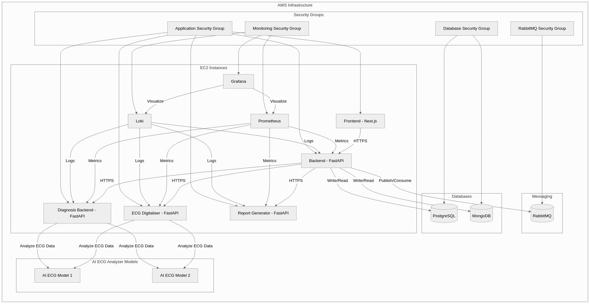

- [System Architecture and AI Model Strategy](#system-architecture-and-ai-model-strategy)
  - [BEFORE WE START](#before-we-start)
- [A. System Architecture (Mandatory)](#a-system-architecture-mandatory)
  - [High-Level Service Map](#high-level-service-map)
  - [Example AWS Infrastructure](#example-aws-infrastructure)
  - [Basic Process Flow](#basic-process-flow)
  - [Service Breakdown](#service-breakdown)
  - 
- [B. Model Strategy](#b-model-strategy)
  - [ECG Information Extraction and Interpretation](#ecg-information-extraction-and-interpretation)
  - [How will the system extract and interpret ECG information?](#how-will-the-system-extract-and-interpret-ecg-information)
  - [Will it use pre-trained LLMs or fine-tuned models for report generation?](#will-it-use-pre-trained-llms-or-fine-tuned-models-for-report-generation)
  - [How will it ensure medical accuracy, interpretability, and explainability?](#how-will-it-ensure-medical-accuracy-interpretability-and-explainability)
  - [Scientific Approach: Explain how medical accuracy can be ensured using AI (e.g., referencing research on ECG analysis models).](#scientific-approach-explain-how-medical-accuracy-can-be-ensured-using-ai-eg-referencing-research-on-ecg-analysis-models)
  - [Future Improvements](#future-improvements)

# System Architecture and AI Model Strategy

### BEFORE WE START

This is very basic scalable architecture example of ECG parsing application infrastructure. We can infinitly improve and
add various layers, but we don't have time and we don't have enough info about application details.

# A. System Architecture (Mandatory)

### High-Level Service Map

### Example AWS Infrastructure

AWS Infrastrucutre diagram is just an example to easily showcase main infrastructure components. Yet for production
purposes, it would be better to have these services deployed using Kubernetes or any other container orchestration tool.

### Basic Process Flow

### Service Breakdown

- **Client side**: Any Client side application can be used (GUI, Mobile App, Web App)
- **Application Server**: Acts as the central hub for handling requests, routing them to appropriate services, and
  managing the overall application logic. For initial state - user account management part can be implemented here.
- **Data Digitalization**:
  Converts ECG images to digital ECG formats via image processing
- **Diagnostic Backend**: Handles the core logic for diagnosing ECG images.

  - It Receives Digitalized ECG result with metadata, Identifies the problems, risks using ECG AI Model(Multimodel
    system).
  - After Received information is passed to Generative AI model to generate final user friendly recommendations with
    explained problems and risks.

- **Reporting Service**: Generates reports based on the diagnostic results and other relevant data. It formats and
  delivers final reports to client in supported formats(PDF/JSON/etc..)
- **Data Storage**:
  - MongoDB:
    - Used for storing Diagnosed reports, Digitalized ECG results
  - PostgreSQL:
    - Used for storing User accounts, Sessions, and other application data
  - Storage:
    - Used for storing applications persistent data.
- **Security Layers and Data Handling Strategy**:
  - Databases:
    - In Use and in Rest Encryptions
    - Strict service based access control
    - Audit/Access logs
  - Application Layer:
    - Secure session management
    - Enforced Multifactor authentication
    - RBAC
    - Strong Input validation
    - Anonymization and Pseudonymization, remove, alter or obfuscate identifiable information where possible
    - Transit layer encryption HTTPS only
    - Cross Service connections with certificate provision only for exposed services.
    - Continuous Automated Security checks for all layers
    - Automated Credential Rotation
    - Incident response measures(Backup Restorations, Snapshots etc.. )

###

---

# B. Model Strategy

### ECG Information Extraction and Interpretation

**We will not be using OCR for this case, we will use image processing and signal extraction techniques to generate
digital variant of ECG data**:

### How will the system extract and interpret ECG information?

- Image Processing:
  - Remove noise and enhance the image quality.
  - Convert the image to black and white (binarization) to separate the ECG trace from the background.
  - Remove grid lines using algorithms like the Hough Transform.
  - Correct any skew or artifacts from the image.
  - Isolate the ECG trace from the background.
  - Convert the ECG trace into a digital signal by mapping the vertical position (voltage) and horizontal position (
    time) of the trace
  - Normalize and resample the signal to ensure consistency.
- Data Finalization
  - Generate a structured data containing biological information and extracted ecg result for analysis by AI models.

---

### Will it use pre-trained LLMs or fine-tuned models for report generation?

[Realistic] We will use a set of pre-trained LLMs for ecg result processing to predict risks or identify deviations.

[Desired] We might try to train a single model for all ECG cases

Currently we have following technologies/models available for ECG result processing. So we can pass digitalized results
to them.

| **Tool/Model**                  | **Area of Application**                                            |
| ------------------------------- | ------------------------------------------------------------------ |
| **Aire**                        | Predicting fatal heart disease and early mortality from ECGs       |
| **Aire-DM**                     | Predicting type 2 diabetes risk from ECG data                      |
| **CNN-LSTM Models**             | Arrhythmia detection and classification                            |
| **AI for AF Detection**         | Identifying atrial fibrillation (AF) from Holter monitor data      |
| **iKardo**                      | ECG classification into critical and non-critical cases            |
| **AI ECG Interpretation Tools** | Automated ECG signal analysis for cardiovascular disease detection |

After we will pass the result to fine-tuned GPT models to generate user friendly report data

---

### How will it ensure medical accuracy, interpretability, and explainability?

Currently - it won't.
Medical accuracy is critical aspect for any AI model.
We will try to use RAG to improve context awareness and to keep up to date with latest medical guidlines. We will
continously monitor the results and improve it.
Interpretability and explainability will achieved by using GPT models to generate user friendly and understandable
reports.

---

### Scientific Approach: Explain how medical accuracy can be ensured using AI (e.g., referencing research on ECG analysis models).

Our ECG AI diagnostic system must overcome critical accuracy challenges to meet medical standards. Current AI
implementations struggle with limited training data diversity, inconsistent signal quality, poor explainability, and
inadequate cross-device validation—issues. These problems are also mention in numerous of articles about this topic.

[Example: Hannun arrhythmia detection with deep neural network. (Nature Medicine, 2019), Kwon Artificial intelligence algorithm for detecting myocardial infarction using six-lead electrocardiography (Scientific Reports, 2020)]

### Future Improvements

- Each service can be divided into microservices if necessary
- Task based system allows us to plug any data processing, validation and checking mechanism
- Depending on amount of processed data and storage load, there might be a need to migrate to high performant storage
  types.
